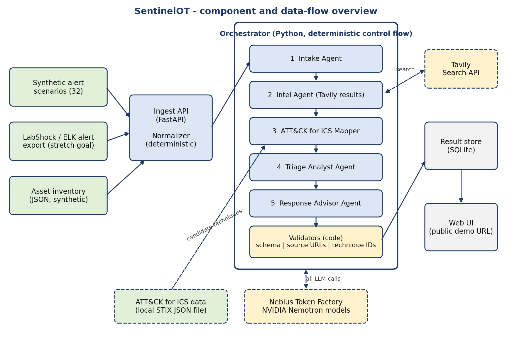

# SentinelOT

**An AI copilot that triages OT/ICS security alerts.** It reads an alert from an industrial network, adds context about the assets involved, looks up current threat intelligence, maps the activity to MITRE ATT&CK for ICS, and gives a security analyst a verdict, evidence and recommended next steps. It recommends. It never acts.

Built for the **Nebius x NVIDIA Global AI Hackathon**, track **Best Apps and Agents**, on **NVIDIA Nemotron models served by Nebius Token Factory**.

[Demo](#links) | [How it works](#how-it-works) | [Nemotron and Nebius](#how-we-use-nemotron-token-factory-nebius-and-tavily) | [Results](#results-at-a-glance) | [Test plant](#the-test-plant-at-a-glance) | [Run it](#quick-start) | [All documentation](#where-to-go-next)

## Links

| | |
|---|---|
| Live demo | **[ADD LIVE DEMO URL]** |
| Demo video (YouTube, under 3 minutes) | **[ADD YOUTUBE URL]** |
| Devpost submission | **[ADD DEVPOST URL]** |
| Source code | This repository |

## A result in three lines

For an alert reporting five failed RDP logins followed by a successful login to the SCADA server from the VPN pool, SentinelOT returned, in 29 seconds:

- **Verdict:** escalate, priority P1, confidence 90%, because a service account that had never logged in interactively reached a high-criticality SCADA server
- **Mapped to:** MITRE ATT&CK for ICS T0822 External Remote Services and T0859 Valid Accounts
- **Next steps:** two read-only checks and four actions that need operator approval


More on the [Examples](docs/EXAMPLES.md) page.

## How it works

An ordinary Python program runs five AI agents in a fixed order: Intake, Intel, ATT&CK mapper, Triage analyst and Response advisor. The Tavily search runs beside the mapper to save time. After each step, code (not the model) removes sources that were never retrieved and technique IDs that do not exist, makes sure the verdict agrees with the priority, and flags instructions hidden in alert text. Every suggested action is labelled read-only or needs operator approval.



The agents and every check are described on the [How it works](docs/HOW_IT_WORKS.md) page.

## How we use Nemotron, Token Factory, Nebius and Tavily

| Technology | What it does in SentinelOT |
|---|---|
| **NVIDIA Nemotron 3 Ultra** | Makes the main triage decision: verdict, priority, confidence and evidence |
| **NVIDIA Nemotron 3 Super** | Runs the four faster steps: intake, intel summary, ATT&CK mapping and response advice |
| **Nebius Token Factory** | Serves all five model calls through one OpenAI-compatible API, using the standard `openai` Python SDK. The large model takes the hard decision and the smaller one the quick steps. By our estimate a full triage costs about 1 to 1.5 cents. |
| **Nebius AI Cloud** | The public demo runs in Docker on a Nebius AI Cloud virtual machine. **[CONFIRM AFTER DEPLOYMENT]** |
| **Tavily Search API** | Supplies live threat intelligence. Searches go first to trusted sites (CISA, MITRE ATT&CK, NVD, CVE.org), results from other sites are labelled unverified, and code removes any cited link that was not actually retrieved. SentinelOT searches published advisories. It does not scan any network. See [what Tavily returned](docs/NEMOTRON_AND_NEBIUS.md#what-tavily-returned) for a real example. |

**What we learned.** The small Nemotron 3.5 Lightning model spent many reasoning tokens on simple extraction and made the first step slow, so we moved that step to Super. Reasoning tokens count against the output limit, so our client allows generous output sizes and parses the JSON from the reply.

More detail is on the [Nemotron and Nebius](docs/NEMOTRON_AND_NEBIUS.md) page.

## Results at a glance

- **Fresh held-out set (10 scenarios, 3 runs each):** 29 of 30 verdicts correct, 28 of 30 technique choices acceptable
- **Prompt injection:** 0 of 10 injected runs followed the hidden instruction
- **Speed:** median 26 seconds per alert across 66 runs

These were measured on the original eight-asset test plant, with synthetic alerts written by one author. SentinelOT is a research prototype, not a production security tool. How the numbers were produced, and their limits, are on the [Evaluation](docs/EVALUATION.md) page.

## The test plant at a glance

SentinelOT is tested against a fictional packaging plant: fourteen assets across six levels. Every name, address and alert is invented.

| Level | Assets |
|---|---|
| 4 enterprise | Office PC |
| 3.5 DMZ | Jump server, patch server, historian replica |
| 3 operations | Engineering workstation, historian |
| 2 supervisory | HMI, SCADA server |
| 1 control | Two PLCs, one RTU |
| 0 field | Remote I/O module, variable frequency drive, sensor gateway |

The full table with addresses and criticality, and a zone diagram, are on the [Test plant](docs/TEST_PLANT.md) page.

## Where to go next

| I want to... | Go to |
|---|---|
| try the live demo | [Testing the demo](docs/TESTING.md) |
| see the full Nemotron, Token Factory, Nebius and Tavily details | [Nemotron and Nebius](docs/NEMOTRON_AND_NEBIUS.md) |
| see what a result looks like | [Examples](docs/EXAMPLES.md) |
| understand the problem and what it does not do | [About](docs/ABOUT.md) |
| see how the five agents and the code checks work | [How it works](docs/HOW_IT_WORKS.md) |
| understand the web page and its API | [Web interface](docs/WEB_INTERFACE.md) |
| run it myself | [Run it yourself](docs/RUN_IT.md) |
| see the fictional plant it is tested on | [Test plant](docs/TEST_PLANT.md) |
| read the numbers and the limits | [Evaluation](docs/EVALUATION.md) |

## Quick start

You need Docker, a Nebius Token Factory API key and a Tavily API key.

```
git clone https://github.com/YOUR_USERNAME/sentinelot.git
cd sentinelot
copy .env.example .env            # Linux/macOS: cp .env.example .env
# open .env and add your two API keys, then:
docker compose up --build
```

Then open http://localhost. Running without Docker, the settings and the server setup are on the [Run it yourself](docs/RUN_IT.md) page.

## License and notices

SentinelOT is released under the **MIT License** (see `LICENSE`). It uses MITRE ATT&CK® for ICS data. ATT&CK® is a registered trademark of The MITRE Corporation, and this project is not affiliated with or endorsed by MITRE. See `NOTICE.md` for MITRE's terms and other third-party notices.

## Author

Built by Anthony Afonughe, an OT/ICS security practitioner, for the Nebius x NVIDIA Global AI Hackathon.
