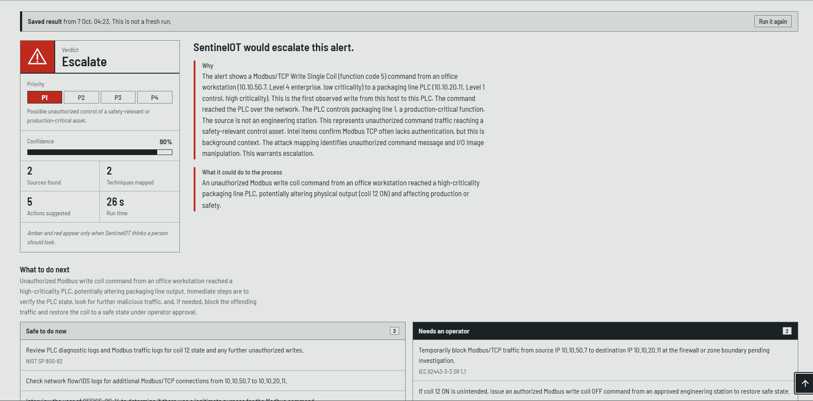
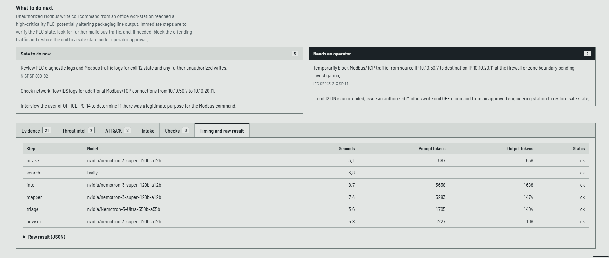
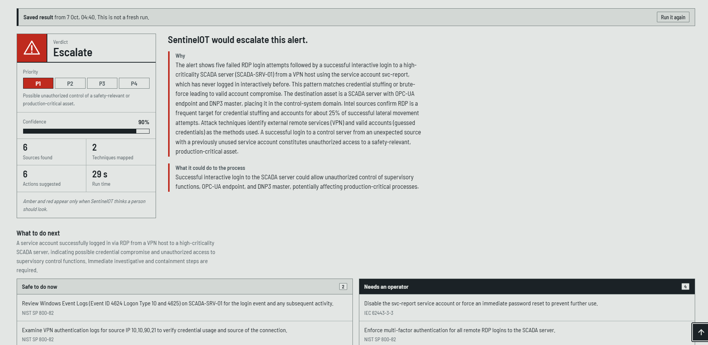

# Examples

[Home](../README.md) | [About](ABOUT.md) | **Examples** | [How it works](HOW_IT_WORKS.md) | [Nemotron and Nebius](NEMOTRON_AND_NEBIUS.md) | [Web interface](WEB_INTERFACE.md) | [Run it](RUN_IT.md) | [Testing the demo](TESTING.md) | [Test plant](TEST_PLANT.md) | [Evaluation](EVALUATION.md)

---

Every example here uses a synthetic alert in a fictional plant (see [Test plant](TEST_PLANT.md)). To try one yourself, follow [Testing the demo](TESTING.md).

## Example 1: an office PC writes to a production PLC

**The alert:** a Modbus/TCP "write single coil" command (function code 5) from an office PC to the line 1 PLC, setting coil 12 to ON. The source host had never written to this PLC before.

SentinelOT returned, in 26 seconds:

- **Verdict:** escalate, priority P1, confidence 90%
- **Why:** an office workstation (Level 4 enterprise, low criticality) sent the first write it had ever sent to a high-criticality PLC in Level 1 control, and it is not an engineering station. The result called this unauthorized command traffic reaching a safety-relevant control asset.
- **ATT&CK for ICS:** two techniques mapped. The explanation mentions an unauthorized command message and I/O image manipulation.
- **Threat intelligence:** two CISA advisories, both marked as on the trusted list: one about a Delta Electronics PLC that exposes Modbus TCP without authentication, and one about the Schneider Electric Modicon Modbus protocol sending commands in cleartext. They are background about Modbus in general, not about the plant's own PLC.
- **Evidence:** 21 lines, each citing a field of the alert, a field of the asset record or a retrieved finding
- **Next steps:** three read-only checks (review the PLC diagnostic and Modbus traffic logs for the state of coil 12, check network flow and IDS logs for other connections from the same host, and interview the user of the office PC) and two that need operator approval (temporarily block Modbus traffic from the source to the PLC at the firewall or zone boundary, and, if the change was not intended, write the coil back to OFF from an approved engineering station)

An earlier run of the same alert returned a confidence of 0.92 in about 28 seconds and mapped T0831, Manipulation of Control. Results vary between runs, which is why the [Evaluation](EVALUATION.md) page reports repeated runs.

## Example 2: a successful remote login to the SCADA server

**The alert:** five failed RDP logins, then a successful interactive login to the SCADA server from the VPN address pool, using a service account that had never logged in interactively before.

SentinelOT returned, in 29 seconds:

- **Verdict:** escalate, priority P1, confidence 90%
- **Why:** a successful interactive login to a high-criticality SCADA server in the Level 2 supervisory zone, from a VPN host, after failed attempts and with an account that had never been used this way. The asset record showed the server hosts an OPC-UA endpoint and a DNP3 master, so supervisory control was at stake.
- **ATT&CK for ICS:** T0822 External Remote Services and T0859 Valid Accounts
- **Threat intelligence:** six sources retrieved, including a finding that RDP is among the protocols targeted by credential stuffing
- **Evidence:** 20 lines, each citing a field of the alert, a field of the asset record or a retrieved finding
- **Next steps:** two read-only checks (review the Windows logon events on the server, and review the VPN authentication logs for the source address) and four that need operator approval (disable or reset the service account, require multi-factor authentication for remote RDP, block RDP from the VPN zone to the supervisory zone unless it is approved, and collect volatile memory and a forensic image of the server)

## Other runs from the live demo

| Alert | Verdict | Priority | Confidence | Run time |
|---|---|---|---|---|
| s01: Modbus write coil command to PLC from non-engineering host | Escalate | P1 | 90% | 26 s |
| s09: Repeated failed OPC-UA authentication | Investigate | P2 | 75% | 24 s |
| x01: Successful remote login to SCADA server from VPN | Escalate | P1 | 90% | 29 s |

These are single runs. Results vary between runs, so see [Evaluation](EVALUATION.md) for what repeated runs show.

## What every result contains

- **Verdict, priority and confidence:** escalate, investigate or likely benign; P1 (highest) to P4; and a confidence score.
- **Why, and what it could do to the process:** a short explanation in plain language.
- **Evidence:** the facts the decision rests on, each tied to its source.
- **Threat intelligence:** retrieved sources, marked as trusted or unverified.
- **ATT&CK for ICS techniques:** chosen only from the official list, or none.
- **Next steps:** each labelled *read-only* or *needs operator approval*. SentinelOT never carries them out.
- **Checks and timing:** what the code checks removed or flagged, and the model, time and token use of every step.

---

[Back to the README](../README.md)
