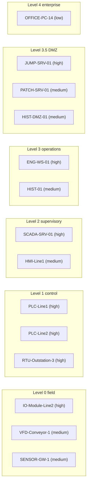

# Test plant (synthetic)

[Home](../README.md) | [About](ABOUT.md) | [Examples](EXAMPLES.md) | [How it works](HOW_IT_WORKS.md) | [Nemotron and Nebius](NEMOTRON_AND_NEBIUS.md) | [Web interface](WEB_INTERFACE.md) | [Run it](RUN_IT.md) | [Testing the demo](TESTING.md) | **Test plant** | [Evaluation](EVALUATION.md)

---

SentinelOT is tested against a fictional packaging plant with fourteen assets arranged in six levels, from Level 0 field devices to Level 4 enterprise, with a Level 3.5 DMZ between operations and the enterprise network. Every name, address, account and alert is invented. No real plant, employer or client data is used.

The asset inventory is [`data/assets.json`](../data/assets.json). SentinelOT looks up both ends of every alert in it, which is how it knows an asset's criticality, its zone and whether a change window is open. Seven of the fourteen assets are rated high criticality, six medium and one low.

| Asset | Address | Type | Zone | Criticality | Function |
|---|---|---|---|---|---|
| IO-Module-Line2 | 10.10.10.12 | Remote I/O module | Level 0 field | High | EtherNet/IP remote I/O for PLC-Line2, drives the line 2 outputs |
| VFD-Conveyor-1 | 10.10.10.21 | Variable frequency drive | Level 0 field | Medium | Drives the line 1 conveyor motor, controlled by PLC-Line1 over EtherNet/IP |
| SENSOR-GW-1 | 10.10.10.30 | Sensor gateway | Level 0 field | Medium | Modbus TCP gateway for line 1 temperature and pressure sensors, read by PLC-Line1 |
| PLC-Line1 | 10.10.20.11 | PLC | Level 1 control | High | Packaging line 1 control |
| PLC-Line2 | 10.10.20.12 | PLC | Level 1 control | High | Packaging line 2 control, has an EtherNet/IP I/O module |
| RTU-Outstation-3 | 10.10.20.30 | RTU | Level 1 control | High | Utility metering outstation, reports to SCADA over DNP3 |
| SCADA-SRV-01 | 10.10.30.10 | SCADA server | Level 2 supervisory | High | SCADA server with OPC-UA endpoint and DNP3 master |
| HMI-Line1 | 10.10.30.5 | HMI | Level 2 supervisory | Medium | Operator screen for line 1 |
| HIST-01 | 10.10.40.20 | Historian | Level 3 operations | Medium | Process data historian, polls PLCs read-only |
| ENG-WS-01 | 10.10.40.8 | Engineering workstation | Level 3 operations | High | PLC programming. Approved change window: Tuesday 08:00-10:00 local time |
| PATCH-SRV-01 | 10.10.45.10 | Patch server | Level 3.5 DMZ | Medium | Stages approved patches for OT. Pushes to ENG-WS-01 only inside the Tuesday change window |
| HIST-DMZ-01 | 10.10.45.20 | Historian replica | Level 3.5 DMZ | Medium | Read-only copy of historian data for the enterprise network. Receives from HIST-01 only |
| JUMP-SRV-01 | 10.10.45.5 | Jump server | Level 3.5 DMZ | High | Remote access entry point for OT. Approved vendor access window: Wednesday 09:00-11:00 local time |
| OFFICE-PC-14 | 10.10.50.7 | Office PC | Level 4 enterprise | Low | Office workstation, not an engineering station |

The diagram shows zones only. The inventory does not define which assets talk to which.

**Limits of the test plant:** hardwired sensors and actuators with no network address are not modelled. The inventory lists zones and devices, not network paths. Addresses outside the inventory, such as the VPN pool, are treated as unknown sources.

---

[Back to the README](../README.md)
