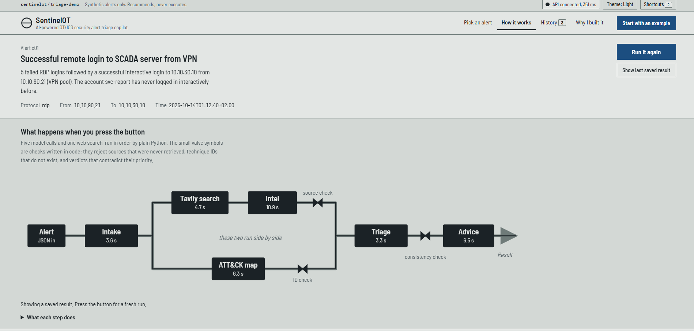
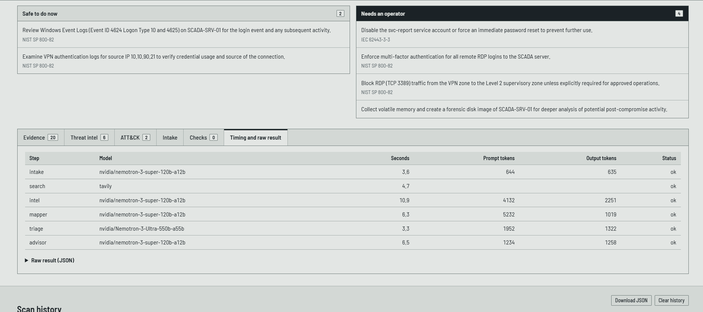

# Web interface

[Home](../README.md) | [About](ABOUT.md) | [Examples](EXAMPLES.md) | [How it works](HOW_IT_WORKS.md) | [Nemotron and Nebius](NEMOTRON_AND_NEBIUS.md) | **Web interface** | [Run it](RUN_IT.md) | [Testing the demo](TESTING.md) | [Test plant](TEST_PLANT.md) | [Evaluation](EVALUATION.md)

---

The interface is a single file, `static/index.html`, with no build step. It is served by the same FastAPI app.

- **Pick an alert** from the list (the *Set* column shows whether it belongs to the development or a held-out set), or press **Start with an example**.
- **Live pipeline drawing.** The drawing of the five agents, the search step and the three code checks lights up as each step finishes, using the real step timings from the run. The search and the ATT&CK mapper are drawn side by side because they run side by side.
- **Result view.** A verdict panel (verdict, a P1 to P4 priority scale, a confidence bar and four counters), a short *Why* and *What it could do to the process*, next steps in two lanes (*Safe to do now* and *Needs an operator*), and tabs for Evidence, Threat intel, ATT&CK, Intake, Checks, and Timing and raw result.
- **Show last saved result** reads the most recent stored run of the chosen alert from the server, so the demo still works if the model service is slow or a run limit has been reached.
- **Scan history.** Every run is saved in the visitor's own browser (not on the server). The last 20 are kept, can be reopened without running again, downloaded as JSON or cleared. When the page is reopened, the latest saved run is shown again and marked as saved.
- **Keyboard shortcuts:** `j` and `k` move through alerts, `r` runs the selected alert, `/` jumps to the list, `t` switches theme, `?` lists the shortcuts.
- **Also:** light, dark and automatic themes, smooth scrolling from the navigation bar, and a back-to-top button.
- **If the API cannot be reached** (for example when the file is opened straight from disk), the page shows clearly labelled sample data for two alerts instead of failing silently. Sample runs are never saved to history.
- **Footer details.** The repository link and any personal links are set in the `ABOUT` block near the top of the script in `static/index.html`. Empty values are not shown.

## Screenshots

**The pipeline drawing after a finished run.** Every step shows its real time. The two small valve symbols mark where code checks the output, and the search and the ATT&CK mapper are drawn side by side because they run side by side.

**The timing tab.** It lists the model, time, prompt tokens and output tokens of every step. In this run the six steps add up to 35.3 seconds, but the run took 29 seconds, because the search and the ATT&CK mapper ran side by side.

## API used by the page

| Endpoint | Purpose |
|---|---|
| `GET /api/health` | Returns `{"ok": true}` when the server is running |
| `GET /api/scenarios` | Lists the synthetic alerts |
| `POST /api/demo/{id}` | Starts a run of a named alert and returns a `job_id` |
| `GET /api/jobs/{job_id}` | Returns the run status, the steps finished so far and, when done, the result |
| `GET /api/saved/{id}` | Returns the last stored result for an alert |
| `POST /api/triage` | Free-form alert submission, protected by the `X-Admin-Token` header |

---

[Back to the README](../README.md)
